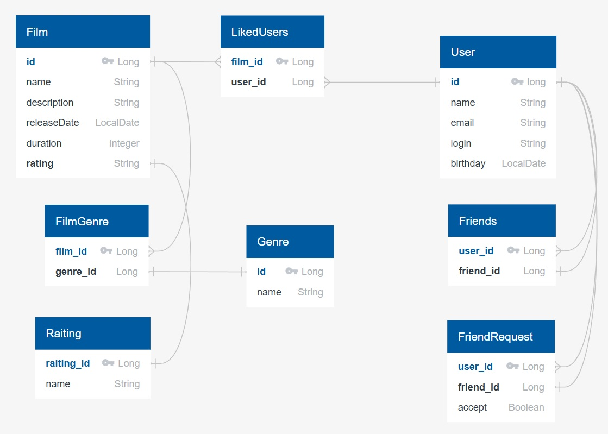

# java-filmorate
Template repository for Filmorate project.
Данный проект реализован в рамках курса "Java разработчик" на платформе Яндекс Практикум.
На схеме базы данных, представленной ниже, отражены взаимосвязи между элементами.
При поступлении запроса о жанре фильма будет указываться ID фильма, по этому ID в таблице FilmGenre будут
найдены все соответствующие жанры, их ID, а по их ID будут найдены названия.

